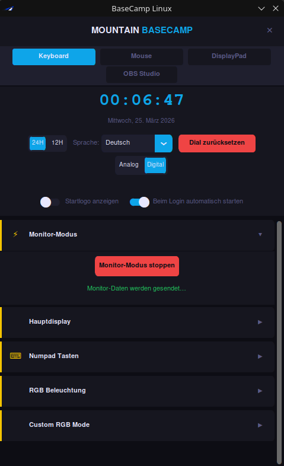

<p align="center">
  
</p>

# BaseCamp Linux

**Unofficial Linux companion app for Mountain peripherals.**

Mountain Base Camp is only available on Windows — this project brings full device control for the **Everest Max keyboard** and **Makalu 67 mouse** to Linux: display control, RGB lighting, button actions, monitor metrics, DPI, button remapping and OBS integration.

  

---

## Screenshot

<p align="center">
  
</p>

---

## Keyboard — Everest Max

The keyboard panel is split into a persistent **dashboard** at the top and collapsible sections below:

- **Dashboard** — Live clock display with 24H/12H toggle, language switcher (DE/EN + custom), Analog/Digital display style, splash screen and autostart toggles
- **Monitor Mode** — Start/stop live keyboard display with CPU%, GPU%, RAM%, HDD% and Network MB/s metrics
- **Main Display** — Switch between image and clock mode, upload any image to the keyboard's main display — automatically converted to the correct format
- **Numpad Keys** — Assign actions (Shell, URL, Folder, App) and custom button images (including GIF frame picker) to D1–D4 — automatically converted to the correct format
- **RGB Lighting** — Control keyboard RGB effects (Wave, Tornado, Reactive, Yeti, Matrix, and more) with speed, brightness, color and direction — settings saved automatically
- **Custom RGB Mode** — Per-key color editor: click or drag-select keys, assign colors, use the eyedropper (Alt+click), undo (Ctrl+Z), and save/load named presets — side LEDs fully selectable around both keyboard and numpad bezels (see [Custom RGB Mode — Keyboard](#custom-rgb-mode--keyboard) below)
- **OBS Integration** — Connect to OBS via WebSocket and trigger scene switches, recording or streaming from any D-button

### Features

- **Display styles** — Switch between Analog and Digital clock on the keyboard display
- **24H / 12H** — Toggle clock format
- **Monitor mode** — Live metrics on the keyboard display: CPU%, GPU%, RAM%, HDD%, Network MB/s
- **Button actions (D1–D4)** — Assign Shell commands, URLs, folders or installed apps to D1–D4 — with native folder picker and searchable app picker. Use **Reset Buttons Flash** after first setup or when switching from Mountain Base Camp — BaseCamp may have stored its own actions in the keyboard's flash memory, which can cause two actions to fire on a single button press. Reset Buttons Flash overwrites all four slots with your configured actions, clearing any leftover BaseCamp data.
- **Image upload (D1–D4)** — Upload images to D-buttons via the **Upload Images** dialog or individual per-slot upload buttons — automatically converted and resized (GIF frame picker included). Images are saved to the **Image Library** for quick reuse.
- **Image Library** — All uploaded images are stored locally as thumbnails. Pick from previously used images with one click instead of browsing the file system every time. Images can be deleted from the library individually.
- **Main display upload** — Upload any image to the keyboard's main display — with Image Library support for quick reuse
- **RGB Lighting** — Full RGB effect control: Wave, Tornado, Tornado Rainbow, Reactive, Yeti, Matrix, Off — with speed, brightness, color pickers and direction — settings saved to config
- **Custom RGB Mode** — Per-key color editor with rubber band selection, eyedropper, undo, and named presets — side LEDs selectable individually around keyboard and numpad — includes built-in Synthwave preset
- **OBS integration** — Connect to OBS via WebSocket and trigger scene switches, recording or streaming from D1–D4 — settings save automatically on change
- **System tray** — Minimize to tray, runs in the background
- **Internationalization** — UI language switchable at runtime via external JSON files (DE + EN included, add your own)

---

## Mouse — Makalu 67

<p align="center">
  
</p>

The mouse panel (VID `0x3282`, PID `0x0003`) provides full control over all Makalu 67 settings — everything saves to the mouse flash and persists across reboots and power cycles.

### RGB Lighting

- Effects: Static, Breathing, RGB Breathing, Rainbow, Responsive, Yeti, Off
- Dual-zone color support for Breathing and Yeti (Zone 1 + Zone 2)
- Speed: Slow / Medium / Fast
- Brightness: 0 / 25 / 50 / 75 / 100
- Rainbow direction: ← / →
- Color presets: 12 quick-select swatches

### Custom RGB

<p align="center">
  
</p>

Click **Open Key Color Editor** to open the per-LED editor. The Makalu 67 has 8 individually addressable LEDs arranged around the mouse body.

- Click an LED to select it, Ctrl+click to multi-select
- Pick a color from the HSV color wheel or quick swatches
- Undo (up to 20 steps)
- Save and load named presets — selected preset is remembered and restored on next open

### DPI

- 5 configurable DPI levels (50–19,000, step 50)
- Reads current values from the mouse on open, polls for profile changes every 1.5 s
- Cycle through levels with the DPI button on the mouse
- Reset to factory defaults (400 / 800 / 1600 / 3200 / 6400)

### Button Remap

- Remap any of the 6 physical buttons (Left, Right, Middle, Back, Forward, DPI+)
- **Categories:** Mouse, DPI, Scroll, Sniper
- **DPI Sniper** — hold a button to temporarily drop to a lower DPI (e.g. 400) for precision aim; profile DPI is restored automatically on release — no software running required, handled entirely by the mouse firmware
- Configurable Sniper DPI via slider + text field
- Left-button remap includes a 10-second safety confirmation dialog — automatically reverts if not confirmed
- Assignments saved to config and restored on next launch

### Settings

- **Polling Rate** — 125 / 250 / 500 / 1000 Hz
- **Button Response** — Debounce time: 2 / 4 / 6 / 8 / 10 / 12 ms
- **Angle Snapping** — On / Off
- **Lift-Off Distance** — Low / High

---

## Custom RGB Mode — Keyboard

<p align="center">
  
</p>

Click **Open Key Color Editor** in the Custom RGB Mode section to open the editor.

### Selecting keys
| Action | Result |
|--------|--------|
| Left-click a key | Select it (deselects others) |
| Ctrl+click | Add/remove key from selection |
| Right-click | Toggle key in/out of selection |
| Click + drag | Rubber band — selects all keys the band touches |
| **Select All** button | Select every key and side LED |
| **Deselect** button | Clear the selection |

Side LEDs are shown as small squares around the keyboard and numpad bezels and work exactly like keys.

### Coloring keys
| Action | Result |
|--------|--------|
| Click the color swatch (top-left) | Open the HSV color wheel picker |
| **Fill Selected** button | Apply the current color to all selected keys |
| **All White** / **All Black** buttons | Fill every key and side LED at once |
| Alt+click a key | Eyedropper — samples that key's color into the swatch |

### Applying to keyboard
| Button | What it does |
|--------|-------------|
| **Apply to Keyboard** | Sends the current colors to the keyboard over USB |
| **Persist to Slot** | Saves colors permanently to the keyboard's flash — survives power cycles and software restarts |

### Undo & Presets
| Action | Result |
|--------|--------|
| Ctrl+Z or **Undo** button | Undo the last color change (up to 20 steps) |
| **Save as…** | Save the current color layout as a named preset |
| **Load** | Apply a saved preset to the canvas |
| **Delete** | Remove a saved preset |

A built-in **Synthwave** preset is included as a starting point.

---

## Upload Images & Image Library

### Upload Images

<p align="center">
  
</p>

Click **Upload Images** in the Numpad Keys section to open the multi-upload dialog.

| Element | Description |
|---------|-------------|
| **D1–D4 tiles** | Click a tile to open the Image Library and pick an image — the thumbnail is shown immediately as a preview |
| **↑ button** | Upload that single slot right away |
| **Upload All** | Upload all four slots sequentially — slots without a selected image are skipped |
| **Status rows** | Per-slot upload status and progress bar |
| **Skip detection** | If the same image is selected again (unchanged), the slot is skipped automatically — no unnecessary flash write |

The last image used per slot is remembered and shown as the tile preview next time you open the dialog.

---

### Image Library

<p align="center">
  
</p>

Every image you upload to D1–D4 or the main display is automatically saved to a local library (`~/.config/mountain-time-sync/icon_library/`). The library opens whenever you click a tile or the individual upload button.

| Element | Description |
|---------|-------------|
| **Browse new file…** | Open the file picker to choose a new image from disk (GIF frame picker included) |
| **Thumbnails** | Click any thumbnail to select it instantly — no file picker needed |
| **✕ button** | Delete an image from the library |

The main display has its own separate library (`main_library/`) with thumbnails that match the display's aspect ratio.

---

## Requirements

### Keyboard Firmware

> **Important:** This software requires keyboard firmware **57** (the first number in the version string).
> The full version `57.24.20` refers to three separate components:
> - `57` — Keyboard main firmware
> - `24` — Numpad firmware
> - `20` — Displaypad firmware
>
> If your version shows as `57.0.0`, your keyboard firmware is correct — the `.0.0` simply means the Numpad and Displaypad are not connected or not detected at that moment.
>
> If your keyboard firmware is not `57`, download and install it manually:
> **[Mountain_Everest_57.24.20.zip](https://mountain.gg/assets/Software/Mountain_Everest_57.24.20.zip)**

### Numpad / Displaypad not detected (version shows `57.0.0`)

If your Numpad or Displaypad firmware shows as `0`, the keyboard is not detecting them. Try the following steps:

1. **Unplug and reconnect** the Numpad and Displaypad cables to the keyboard.
2. **Power cycle** the keyboard by unplugging and replugging the main USB cable.
3. Run the Mountain Base Camp firmware updater on Windows with all components connected — it will detect and update the Numpad and Displaypad firmware automatically.
4. If a component is still not detected, try a different USB port or cable.

---

## Known Issues

### Main display stuck on Mountain logo (rare)

In rare cases the main display shows the original Mountain logo and cannot be overwritten with a new image — the upload appears to complete but the logo stays.

**Cause:** The keyboard's internal flash controller gets into a stuck state.

**Fix:** Click **Reset Dial Image** in the Main Display section of the app. This resets the flash controller and clears the stuck state.

---

## Usage

```bash
python3 gui.py
```

The GUI starts with a splash screen and auto-activates Monitor mode. The app minimizes to the system tray when closed.

---

## Installation

### AppImage (Debian, Ubuntu, Mint, Fedora, Nobara)

Self-contained AppImages are available in the [releases](../../releases). No Python installation required.

| File | Distro |
|------|--------|
| `BaseCamp-Linux-x86_64-debian.AppImage` | Debian, Ubuntu, Linux Mint |
| `BaseCamp-Linux-x86_64-fedora.AppImage` | Fedora, Nobara |

```bash
chmod +x BaseCamp-Linux-x86_64-*.AppImage
./BaseCamp-Linux-x86_64-debian.AppImage   # or -fedora
```

To add BaseCamp Linux to your app menu, run it once with `--install`:

```bash
./BaseCamp-Linux-x86_64-fedora.AppImage --install
```

This installs the icon and desktop entry to `~/.local/share/`. After that you can launch it directly from your application launcher.

USB permissions still need to be set up once (see below).

> If you get a FUSE error on startup, add `--appimage-extract-and-run`:
> ```bash
> ./BaseCamp-Linux-x86_64-fedora.AppImage --appimage-extract-and-run
> ```

---

### Arch / CachyOS / Manjaro — AUR

```bash
paru -S basecamp-linux
```

The udev rule is installed automatically. Just unplug and replug the keyboard after installation.

---

### From source

```bash
git clone https://github.com/ramisotti13-eng/BaseCamp-Linux.git
cd BaseCamp-Linux
pip install customtkinter pillow psutil obsws-python pystray
python3 gui.py
```

> **GPU monitoring** requires `nvidia-smi` (NVIDIA only).

---

### USB permissions (required once, AppImage + source installs)

Both the keyboard (PID `0x0001`) and the Makalu 67 mouse (PID `0x0003`) need USB access. Add both rules in one step:

#### Debian / Ubuntu / Linux Mint

```bash
sudo tee /etc/udev/rules.d/99-mountain.rules <<EOF
SUBSYSTEM=="usb", ATTRS{idVendor}=="3282", ATTRS{idProduct}=="0001", MODE="0660", GROUP="plugdev", TAG+="uaccess"
SUBSYSTEM=="usb", ATTRS{idVendor}=="3282", ATTRS{idProduct}=="0003", MODE="0660", GROUP="plugdev", TAG+="uaccess"
EOF
sudo udevadm control --reload-rules && sudo udevadm trigger
sudo usermod -aG plugdev $USER
```

> Log out and back in after adding the group, then unplug and replug the keyboard and mouse.

#### Fedora / Nobara

```bash
sudo tee /etc/udev/rules.d/99-mountain.rules <<EOF
SUBSYSTEM=="usb", ATTRS{idVendor}=="3282", ATTRS{idProduct}=="0001", MODE="0666"
SUBSYSTEM=="usb", ATTRS{idVendor}=="3282", ATTRS{idProduct}=="0003", MODE="0666"
EOF
sudo udevadm control --reload-rules && sudo udevadm trigger
```

> Unplug and replug the keyboard and mouse. No group changes needed.

#### Arch / CachyOS / Manjaro

```bash
bash   # switch to bash if using Fish
sudo tee /etc/udev/rules.d/99-mountain.rules <<EOF
SUBSYSTEM=="usb", ATTRS{idVendor}=="3282", ATTRS{idProduct}=="0001", MODE="0666"
SUBSYSTEM=="usb", ATTRS{idVendor}=="3282", ATTRS{idProduct}=="0003", MODE="0666"
EOF
sudo udevadm control --reload-rules && sudo udevadm trigger
```

> Unplug and replug the keyboard and mouse. No group changes needed.

---

## Adding a language

Copy `lang/en.json` to `lang/xx.json` (e.g. `lang/fr.json`), translate the values, and it will appear automatically in the language dropdown.

---

## Device compatibility

| Device | VID | PID | Status |
|--------|-----|-----|--------|
| Mountain Everest Max (keyboard) | `0x3282` | `0x0001` | Fully supported |
| Mountain Makalu 67 (mouse) | `0x3282` | `0x0003` | Fully supported |

Other Mountain peripherals may work but are untested.

---

## License

GPL v3 + Non-Commercial — free for personal and open-source use, commercial use prohibited. See [LICENSE](LICENSE) for details.
