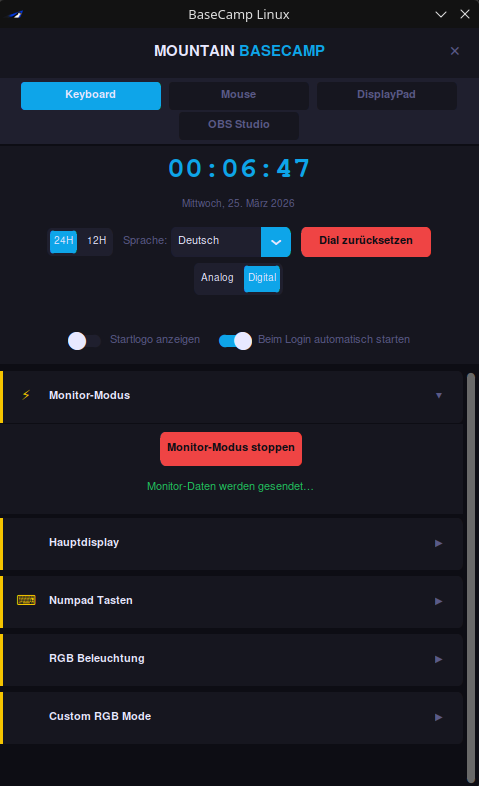
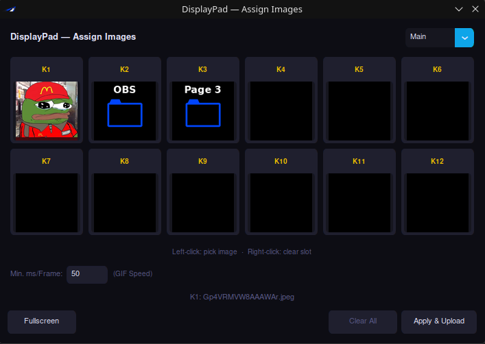
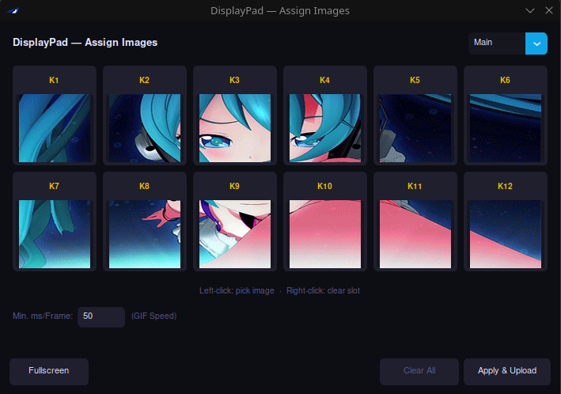

<p align="center">
  
</p>

# BaseCamp Linux

**Unofficial Linux companion app for Mountain peripherals.**

Mountain Base Camp is only available on Windows. This project brings full device control for the **Everest Max keyboard**, **Everest 60 keyboard**, **Makalu 67 mouse**, **Makalu Max mouse**, **DisplayPad** and **MacroPad** to Linux: display control, RGB lighting, button actions, monitor metrics, DPI, button remapping, multi-page display management and OBS integration.

  

<p align="center">
  <a href="https://ko-fi.com/D1D61WIJRD"></a>
</p>

---

## Contents

- [Device compatibility](#device-compatibility)
- [Screenshot](#screenshot)
- [Installation](#installation)
- [Usage](#usage)
- [DisplayPad](#displaypad)
- [Keyboard: Everest Max](#keyboard-everest-max)
- [Keyboard: Everest 60](#keyboard-everest-60)
- [Mouse: Makalu 67 / Makalu Max](#mouse-makalu-67--makalu-max)
- [MacroPad](#macropad)
- [Macros](#macros)
- [OBS Studio: Global Integration](#obs-studio-global-integration)
- [Plugins](#plugins)
- [Control interface & action chains](#control-interface--action-chains)
- [Settings](#settings)
- [Troubleshooting](#troubleshooting)
- [Adding a language](#adding-a-language)
- [Support](#support)
- [License](#license)

---

## Device compatibility

| Device | VID | PID | Status |
|--------|-----|-----|--------|
| Mountain Everest Max (keyboard) | `0x3282` | `0x0001` | Fully supported |
| Mountain Everest 60 ANSI (keyboard) | `0x3282` | `0x0005` | RGB supported |
| Mountain Everest 60 ISO (keyboard) | `0x3282` | `0x0006` | RGB supported |
| Mountain Makalu 67 (mouse) | `0x3282` | `0x0003` | Fully supported |
| Mountain Makalu Max (mouse) | `0x3282` | `0x0002` | Fully supported |
| Mountain DisplayPad | `0x3282` | `0x0009` | Fully supported |
| Mountain MacroPad | `0x3282` | `0x0008` | Fully supported |

---

## Screenshot

<p align="center">
  
</p>

---

## Installation

### AppImage (Debian, Ubuntu, Mint, Fedora, Nobara)

Self-contained AppImages, no Python installation required. They live on the
**[latest release](../../releases/latest)**. Not every release carries them: an
AppImage only has to be rebuilt when something native changes, and the releases
in between ship as a source patch that the application applies to itself. If a
release page has no AppImage, take the newest one that does.

Then let the app bring itself up to date. It asks GitHub on startup, offers the
newest version in a popup, and a source patch is a 200 KB download that installs
in a couple of seconds. See [Automatic updates](#automatic-updates).

| File | Distro |
|------|--------|
| `BaseCamp-Linux-x86_64-debian.AppImage` | Debian, Ubuntu, Linux Mint |
| `BaseCamp-Linux-x86_64-fedora.AppImage` | Fedora, Nobara |

```bash
chmod +x BaseCamp-Linux-x86_64-*.AppImage
./BaseCamp-Linux-x86_64-debian.AppImage   # or -fedora
```

To add BaseCamp Linux to your app menu, run it once with `--install`:

```bash
./BaseCamp-Linux-x86_64-fedora.AppImage --install
```

This installs the icon and desktop entry to `~/.local/share/`. After that you can launch it directly from your application launcher.

USB permissions still need to be set up once (see below).

> **MacroPad owners with an older installation:** the pad arrived in 3.1.1, so a
> `99-mountain.rules` written before that has no line for product id `0x0008`.
> Without it the pad enumerates normally and the application still cannot reach
> it. Run the USB permissions block for your distribution again, it covers the
> pad, then unplug and replug it.

> If you get a FUSE error on startup, add `--appimage-extract-and-run`:
> ```bash
> ./BaseCamp-Linux-x86_64-fedora.AppImage --appimage-extract-and-run
> ```

---

### Arch / CachyOS / Manjaro: AUR

```bash
paru -S basecamp-linux
```

The udev rule is installed automatically. Just unplug and replug the keyboard after installation.

---

### From source

```bash
git clone https://github.com/ramisotti13-eng/BaseCamp-Linux.git
cd BaseCamp-Linux
pip install customtkinter pillow psutil obsws-python pystray hid pyusb
python3 gui.py
```

Two packages are optional and only unlock extras: `tkinterdnd2` for dragging image files onto button tiles, and `python-xlib` as a fallback for reading the cursor position on X11 when `xdotool` is not installed. Both soft-fail, the app starts fine without them.

> **About `hid`:** two unrelated PyPI packages install a module of that name, `hid` and `hidapi`, and they have different APIs. Either works; distribution packages such as `python3-hid` or `python-hidapi` are usually the second one. The app handles both (`shared/hid_compat.py`), so install whichever your system offers.

> **GPU monitoring** requires `nvidia-smi` (NVIDIA only).

> **Language:** the interface ships in English and German and follows your system locale on first start. Settings has a Language selector if you want the other one.

---

### USB permissions (required once, AppImage + source installs)

All Mountain devices need USB access. The rules below cover every supported device.

If the rule is missing or has not been applied, the device still enumerates and still shows up in the app, but nothing you do reaches it. The app says so instead of leaving you guessing: the device reads **no access** beside its name and the screen names the `/dev` entries it was refused, so you do not have to go looking for the cause yourself.

| Device | PID |
|--------|-----|
| Everest Max | `0x0001` |
| Makalu Max | `0x0002` |
| Makalu 67 | `0x0003` |
| Everest 60 ANSI | `0x0005` |
| Everest 60 ISO | `0x0006` |
| MacroPad | `0x0008` |
| DisplayPad | `0x0009` |

#### Debian / Ubuntu / Linux Mint

```bash
sudo tee /etc/udev/rules.d/99-mountain.rules <<EOF
SUBSYSTEM=="usb",    ATTRS{idVendor}=="3282", ATTRS{idProduct}=="0001", MODE="0660", GROUP="plugdev", TAG+="uaccess"
SUBSYSTEM=="usb",    ATTRS{idVendor}=="3282", ATTRS{idProduct}=="0002", MODE="0660", GROUP="plugdev", TAG+="uaccess"
SUBSYSTEM=="usb",    ATTRS{idVendor}=="3282", ATTRS{idProduct}=="0003", MODE="0660", GROUP="plugdev", TAG+="uaccess"
SUBSYSTEM=="usb",    ATTRS{idVendor}=="3282", ATTRS{idProduct}=="0005", MODE="0660", GROUP="plugdev", TAG+="uaccess"
SUBSYSTEM=="usb",    ATTRS{idVendor}=="3282", ATTRS{idProduct}=="0006", MODE="0660", GROUP="plugdev"
SUBSYSTEM=="usb",    ATTRS{idVendor}=="3282", ATTRS{idProduct}=="0008", MODE="0660", GROUP="plugdev", TAG+="uaccess"
SUBSYSTEM=="usb",    ATTRS{idVendor}=="3282", ATTRS{idProduct}=="0009", MODE="0660", GROUP="plugdev", TAG+="uaccess"
SUBSYSTEM=="hidraw", ATTRS{idVendor}=="3282", ATTRS{idProduct}=="0001", MODE="0660", GROUP="plugdev", TAG+="uaccess"
SUBSYSTEM=="hidraw", ATTRS{idVendor}=="3282", ATTRS{idProduct}=="0002", MODE="0660", GROUP="plugdev", TAG+="uaccess"
SUBSYSTEM=="hidraw", ATTRS{idVendor}=="3282", ATTRS{idProduct}=="0003", MODE="0660", GROUP="plugdev", TAG+="uaccess"
SUBSYSTEM=="hidraw", ATTRS{idVendor}=="3282", ATTRS{idProduct}=="0005", MODE="0660", GROUP="plugdev", TAG+="uaccess"
SUBSYSTEM=="hidraw", ATTRS{idVendor}=="3282", ATTRS{idProduct}=="0006", MODE="0660", GROUP="plugdev"
SUBSYSTEM=="hidraw", ATTRS{idVendor}=="3282", ATTRS{idProduct}=="0008", MODE="0660", GROUP="plugdev", TAG+="uaccess"
SUBSYSTEM=="hidraw", ATTRS{idVendor}=="3282", ATTRS{idProduct}=="0009", MODE="0660", GROUP="plugdev", TAG+="uaccess"
EOF
sudo udevadm control --reload-rules && sudo udevadm trigger
sudo usermod -aG plugdev $USER
```

> Log out and back in after adding the group, then unplug and replug all devices.

#### Fedora / Nobara

```bash
sudo tee /etc/udev/rules.d/99-mountain.rules <<EOF
SUBSYSTEM=="usb",    ATTRS{idVendor}=="3282", ATTRS{idProduct}=="0001", MODE="0666", TAG+="uaccess"
SUBSYSTEM=="usb",    ATTRS{idVendor}=="3282", ATTRS{idProduct}=="0002", MODE="0666", TAG+="uaccess"
SUBSYSTEM=="usb",    ATTRS{idVendor}=="3282", ATTRS{idProduct}=="0003", MODE="0666", TAG+="uaccess"
SUBSYSTEM=="usb",    ATTRS{idVendor}=="3282", ATTRS{idProduct}=="0005", MODE="0666", TAG+="uaccess"
SUBSYSTEM=="usb",    ATTRS{idVendor}=="3282", ATTRS{idProduct}=="0006", MODE="0666", TAG+="uaccess"
SUBSYSTEM=="usb",    ATTRS{idVendor}=="3282", ATTRS{idProduct}=="0008", MODE="0666", TAG+="uaccess"
SUBSYSTEM=="usb",    ATTRS{idVendor}=="3282", ATTRS{idProduct}=="0009", MODE="0666", TAG+="uaccess"
SUBSYSTEM=="hidraw", ATTRS{idVendor}=="3282", ATTRS{idProduct}=="0001", MODE="0666", TAG+="uaccess"
SUBSYSTEM=="hidraw", ATTRS{idVendor}=="3282", ATTRS{idProduct}=="0002", MODE="0666", TAG+="uaccess"
SUBSYSTEM=="hidraw", ATTRS{idVendor}=="3282", ATTRS{idProduct}=="0003", MODE="0666", TAG+="uaccess"
SUBSYSTEM=="hidraw", ATTRS{idVendor}=="3282", ATTRS{idProduct}=="0005", MODE="0666", TAG+="uaccess"
SUBSYSTEM=="hidraw", ATTRS{idVendor}=="3282", ATTRS{idProduct}=="0006", MODE="0666", TAG+="uaccess"
SUBSYSTEM=="hidraw", ATTRS{idVendor}=="3282", ATTRS{idProduct}=="0008", MODE="0666", TAG+="uaccess"
SUBSYSTEM=="hidraw", ATTRS{idVendor}=="3282", ATTRS{idProduct}=="0009", MODE="0666", TAG+="uaccess"
EOF
sudo udevadm control --reload-rules && sudo udevadm trigger
```

> Unplug and replug all devices. No group changes needed.

#### Arch / CachyOS / Manjaro

```bash
bash   # switch to bash if using Fish
sudo tee /etc/udev/rules.d/99-mountain.rules <<EOF
SUBSYSTEM=="usb",    ATTRS{idVendor}=="3282", ATTRS{idProduct}=="0001", MODE="0666", TAG+="uaccess"
SUBSYSTEM=="usb",    ATTRS{idVendor}=="3282", ATTRS{idProduct}=="0002", MODE="0666", TAG+="uaccess"
SUBSYSTEM=="usb",    ATTRS{idVendor}=="3282", ATTRS{idProduct}=="0003", MODE="0666", TAG+="uaccess"
SUBSYSTEM=="usb",    ATTRS{idVendor}=="3282", ATTRS{idProduct}=="0005", MODE="0666", TAG+="uaccess"
SUBSYSTEM=="usb",    ATTRS{idVendor}=="3282", ATTRS{idProduct}=="0006", MODE="0666", TAG+="uaccess"
SUBSYSTEM=="usb",    ATTRS{idVendor}=="3282", ATTRS{idProduct}=="0009", MODE="0666", TAG+="uaccess"
SUBSYSTEM=="hidraw", ATTRS{idVendor}=="3282", ATTRS{idProduct}=="0001", MODE="0666", TAG+="uaccess"
SUBSYSTEM=="hidraw", ATTRS{idVendor}=="3282", ATTRS{idProduct}=="0002", MODE="0666", TAG+="uaccess"
SUBSYSTEM=="hidraw", ATTRS{idVendor}=="3282", ATTRS{idProduct}=="0003", MODE="0666", TAG+="uaccess"
SUBSYSTEM=="hidraw", ATTRS{idVendor}=="3282", ATTRS{idProduct}=="0005", MODE="0666", TAG+="uaccess"
SUBSYSTEM=="hidraw", ATTRS{idVendor}=="3282", ATTRS{idProduct}=="0006", MODE="0666", TAG+="uaccess"
SUBSYSTEM=="hidraw", ATTRS{idVendor}=="3282", ATTRS{idProduct}=="0009", MODE="0666", TAG+="uaccess"
EOF
sudo udevadm control --reload-rules && sudo udevadm trigger
```

> Unplug and replug all devices. No group changes needed.

---

## Usage

```bash
python3 gui.py
```

The GUI starts with a splash screen and auto-activates Monitor mode. The app minimizes to the system tray when closed.

| Flag | Effect |
|------|--------|
| `--minimized` | Start straight to the tray, no splash screen (what the autostart entry uses) |
| `--install` | Install the icon and desktop entry to `~/.local/share/`, then exit (AppImage) |
| `--ctl '<json>'` | Send one command to the running instance, print the JSON reply and exit 0 on success, 1 on failure |

---

## DisplayPad

<p align="center">
  
</p>

The DisplayPad screen provides full control over all 12 display buttons (102×102 pixels each) with image upload, animated GIF support, multi-page navigation and button actions. Pages are tabs along the top, the selected key is edited in the column on the right, and the row under the keys holds what belongs to the page itself: its name, its auto-timeout, and the minimum milliseconds per GIF frame.

### Button Images (K1–K12)

<p align="center">
  
</p>

- Assign individual images or animated GIFs to each of the 12 display buttons, one key at a time on the screen or all twelve at once in **Assign images**
- **Icon Library** with 39 bundled icons (Media, Social, System, Navigation, Numbers 1–12) plus all previously uploaded images, so you pick with one click instead of browsing the file system
- Images are automatically resized and converted to the device's BGR format

### Fullscreen Image & GIF

<p align="center">
  
</p>

Upload a single image or animated GIF that is **automatically split across all 12 displays** as one seamless picture, with no manual tile preparation needed. The app handles splitting, resizing and frame synchronisation. Fullscreen images and GIFs are saved to a dedicated library for quick reuse.

### Multi-Page System

- **Name your pages.** Every page, including the one the app opens on, has a name you choose and can rename at any time. Buttons, chain steps and timeouts all point at a page by that name, so a rename follows through everywhere
- **Any key can go to any page.** There are no fixed folder slots and no page limit: build a carousel (A to B to C to A), a hub with a back key on every page, or anything in between
- **A "Back" key is just a page action** pointing at the page you came from. New pages get one on K1 for convenience, and you can move, retarget or delete it
- **Create, rename and delete pages** from the tab bar above the keys: "+ New page" adds one, and the row under the keys renames or deletes the page you are on. Deleting warns you first, listing every button and timeout that still points at that page
- **Per-page auto-timeout:** a page can return to another page (or the previous one) a number of seconds after it is shown, or after the last key press on it. Set it in the same row, under the keys
- Each page is stored in its own file under `~/.config/mountain-time-sync/displaypad_pages/`, named after the page
- Fullscreen GIFs work on any page with page navigation still functional underneath
- Page switching re-uploads all 12 button images to the device automatically, and plugin widgets bound to a key follow the page they belong to

### Button Actions (K1–K12)

- **Action types:** Shell command, URL, Folder, App, Page navigation, OBS (Scene/Record/Stream), Macro, Keypress, Text, and **Redefine key** (one key rewrites another key's action). Installed plugins can add their own types to this list
- **Three slots per key:** the action itself, an optional second action that runs with it ("also on press"), and an optional **double-click** action on a quick second press
- The **Text** action types out any string when you press the button (great for Everest 60 owners who miss F-keys, or for snippets you find yourself typing all the time)
- Keypress and Text both work on X11 and Wayland (the app picks `xdotool` or `ydotool` automatically), including F13-F24 for shortcuts no physical key can trigger
- Actions save immediately on change, no confirmation button needed
- Key events detected via HID with debounce, actions execute even during GIF animation
- Shell and App actions start in their own systemd scope with a clean environment, so a launched program behaves exactly as if you had started it from your desktop launcher

### Drag & Drop

You can drag a PNG, JPG, GIF or WebP straight from your file manager onto a button tile in the "Assign Images" window, which the **Assign images** button in the header opens. The image is imported into the library and uploaded to the device, exactly as if you had clicked the slot and browsed for it.

### Icon Rotation

- Rotate all button icons by **0° / 90° / 180° / 270°** for mounting the pad in any orientation (e.g. SimRacing setups)
- Preview thumbnails rotate live in the GUI
- Rotation setting persists across restarts

### Brightness & key debounce

Next to the rotation dropdown in the panel header sit two more: **☀ brightness** (0 / 25 / 50 / 75 / 100 %, applied to the pad immediately and re-applied on every reconnect) and **⏱ debounce** (0.2 s to 1.0 s), the minimum gap between two presses of the same key before the action fires again. Turn debounce down if your keys feel sluggish, up if a single press occasionally triggers twice. Keys that have a double-click action are exempt and use a short fixed anti-bounce instead, otherwise a one-second debounce would swallow the second tap. Both settings persist across restarts.

---

## Keyboard: Everest Max

> **Everest Core owners:** the Core is the same keyboard as the Max without the numpad and the media dock, and it reports the same USB id, so the application currently shows those controls to everybody. `tools/everest_probe.py` reports what your keyboard says is attached. It reads only and needs no Python packages; please attach the file it writes to an issue and the screen can be taught to hide what is not there.

The keyboard panel is split into a persistent **dashboard** at the top and collapsible sections below:

- **Dashboard**: Live clock display with 24H/12H toggle, language switcher (DE/EN + custom), Analog/Digital display style, splash screen and autostart toggles
- **Monitor Mode**: Start/stop live keyboard display with CPU%, GPU%, RAM%, HDD%, Network MB/s and volume metrics
- **Main Display**: Switch between image, clock, volume and the metric modes, upload any image to the keyboard's main display, automatically converted to the correct format. Volume mode needs Monitor Mode running, which is what sends the level to the keyboard
- **Numpad Keys**: Assign actions (Shell, URL, Folder, App, OBS, Macro, Keypress, Text, Page navigation, Redefine key) and custom button images (including GIF frame picker) to D1–D4, automatically converted to the correct format
- **RGB Lighting**: Control keyboard RGB effects (Wave, Tornado, Reactive, Yeti, Matrix, and more) with speed, brightness, color and direction. Settings are saved automatically
- **Custom RGB Mode**: Per-key color editor: click or drag-select keys, assign colors, use the eyedropper (Alt+click), undo (Ctrl+Z), and save/load named presets. Side LEDs are fully selectable around both keyboard and numpad bezels (see [Custom RGB Mode: Keyboard](#custom-rgb-mode-keyboard) below)

### Features

- **Display styles**: Switch between Analog and Digital clock on the keyboard display
- **24H / 12H**: Toggle clock format
- **Monitor mode**: Live metrics on the keyboard display: CPU%, GPU%, RAM%, HDD%, Network MB/s, and the system volume of whichever output device is selected
- **Button actions (D1–D4)**: Assign Shell commands, URLs, folders, installed apps, OBS actions, Macros, Keypresses, arbitrary Text, a jump to another tab or a redefine of another key to D1–D4, with a native folder picker, searchable app picker and OBS scene selector. Actions save immediately on change. Use **Reset Buttons Flash** after first setup or when switching from Mountain Base Camp. BaseCamp may have stored its own actions in the keyboard's flash memory, which can cause two actions to fire on a single button press. Reset Buttons Flash overwrites all four slots with your configured actions, clearing any leftover BaseCamp data.
- **Image upload (D1–D4)**: Upload images to D-buttons via the **Upload Images** dialog or individual per-slot upload buttons, automatically converted and resized (GIF frame picker included). Images are saved to the **Image Library** for quick reuse.
- **Image Library**: All uploaded images are stored locally as thumbnails. Pick from previously used images with one click instead of browsing the file system every time. Images can be deleted from the library individually.
- **Main display upload**: Upload any image to the keyboard's main display, with Image Library support for quick reuse
- **RGB Lighting**: Full RGB effect control (Wave, Tornado, Tornado Rainbow, Reactive, Yeti, Matrix, Off) with speed, brightness, color pickers and direction. Settings are saved to config
- **Custom RGB Mode**: Per-key color editor with rubber band selection, eyedropper, undo, and named presets. Side LEDs are selectable individually around keyboard and numpad, and a Synthwave preset is built in
- **System tray**: Minimize to tray, runs in the background
- **Internationalization**: UI language switchable at runtime via external JSON files (DE + EN included, add your own)

### Custom RGB Mode: Keyboard

<p align="center">
  
</p>

Click **Open Key Color Editor** in the Custom RGB Mode section to open the editor.

#### Selecting keys
| Action | Result |
|--------|--------|
| Left-click a key | Select it (deselects others) |
| Ctrl+click | Add/remove key from selection |
| Right-click | Toggle key in/out of selection |
| Click + drag | Rubber band: selects all keys the band touches |
| **Select All** button | Select every key and side LED |
| **Deselect** button | Clear the selection |

Side LEDs are shown as small squares around the keyboard and numpad bezels and work exactly like keys.

#### Coloring keys
| Action | Result |
|--------|--------|
| Click the color swatch (top-left) | Open the HSV color wheel picker |
| **Fill Selected** button | Apply the current color to all selected keys |
| **All White** / **All Black** buttons | Fill every key and side LED at once |
| Alt+click a key | Eyedropper: samples that key's color into the swatch |

#### Applying to keyboard
| Button | What it does |
|--------|-------------|
| **Apply to Keyboard** | Sends the current colors to the keyboard over USB |
| **Persist to Slot** | Saves colors permanently to the keyboard's flash, so they survive power cycles and software restarts |

#### Undo & Presets
| Action | Result |
|--------|--------|
| Ctrl+Z or **Undo** button | Undo the last color change (up to 20 steps) |
| **Save as…** | Save the current color layout as a named preset |
| **Load** | Apply a saved preset to the canvas |
| **Delete** | Remove a saved preset |

A built-in **Synthwave** preset is included as a starting point.

### Upload Images & Image Library

#### Upload Images

<p align="center">
  
</p>

Click **Upload Images** in the Numpad Keys section to open the multi-upload dialog.

| Element | Description |
|---------|-------------|
| **D1–D4 tiles** | Click a tile to open the Image Library and pick an image; the thumbnail is shown immediately as a preview |
| **↑ button** | Upload that single slot right away |
| **Upload All** | Upload all four slots sequentially; slots without a selected image are skipped |
| **Status rows** | Per-slot upload status and progress bar |
| **Skip detection** | If the same image is selected again (unchanged), the slot is skipped automatically, with no unnecessary flash write |

The last image used per slot is remembered and shown as the tile preview next time you open the dialog.

---

#### Image Library

<p align="center">
  
</p>

Every image you upload to D1–D4 or the main display is automatically saved to a local library (`~/.config/mountain-time-sync/icon_library/`). The library opens whenever you click a tile or the individual upload button.

| Element | Description |
|---------|-------------|
| **Browse new file…** | Open the file picker to choose a new image from disk (GIF frame picker included) |
| **Thumbnails** | Click any thumbnail to select it instantly, with no file picker needed |
| **✕ button** | Delete an image from the library |

The main display has its own separate library (`main_library/`) with thumbnails that match the display's aspect ratio.

---

## Keyboard: Everest 60

The Everest 60 panel provides RGB lighting control for the Mountain Everest 60 (ANSI and ISO variants). The app detects which keyboard is connected and automatically switches the panel and layout.

### RGB Lighting

- Effects: Static, Breathing, Breathing Rainbow, Wave, Wave Rainbow, Tornado, Tornado Rainbow, Reactive, Yeti, Off
- Speed, brightness, dual-color and direction controls
- Settings saved to config and restored on next launch

### Custom RGB

- Per-key color editor with 60% ANSI layout (61 keys)
- Click, drag-select, eyedropper and undo, the same controls as on the Everest Max
- Separate presets and config from Everest Max

---

## Mouse: Makalu 67 / Makalu Max

<p align="center">
  
</p>

The mouse panel supports both the **Makalu 67** (PID `0x0003`) and **Makalu Max** (PID `0x0002`). The app detects which mouse is connected and shows the model name in the sidebar and the screen header. The Makalu Max supports 8 programmable buttons (vs 6 on the Makalu 67). All settings save to mouse flash and persist across reboots.

### RGB Lighting

- Effects: Static, Breathing, RGB Breathing, Rainbow, Responsive, Yeti, Off
- Dual-zone color support for Breathing and Yeti (Zone 1 + Zone 2)
- Speed: Slow / Medium / Fast
- Brightness: 0 / 25 / 50 / 75 / 100
- Rainbow direction: ← / →
- Color presets: 12 quick-select swatches

### Custom RGB

<p align="center">
  
</p>

Click **Open Key Color Editor** to open the per-LED editor. The Makalu 67 has 8 individually addressable LEDs arranged in a large ring on top of the mouse.

- Click an LED to select it, Ctrl+click to multi-select
- Pick a color from the HSV color wheel or quick swatches
- Undo (up to 20 steps)
- Save and load named presets. The selected preset is remembered and restored on next open

### DPI

- 5 configurable DPI levels (50–19,000, step 50)
- Reads current values from the mouse on open, polls for profile changes every 1.5 s
- Cycle through levels with the DPI button on the mouse
- Reset to factory defaults (400 / 800 / 1600 / 3200 / 6400)

### Button Remap

- Remap any of the 6 physical buttons (Left, Right, Middle, Back, Forward, DPI+)
- **Categories:** Mouse, DPI, Scroll, Sniper
- **DPI Sniper**: hold a button to temporarily drop to a lower DPI (e.g. 400) for precision aim; profile DPI is restored automatically on release. No software has to be running, the mouse firmware handles it
- Configurable Sniper DPI via slider + text field
- Left-button remap includes a 10-second safety confirmation dialog, which reverts automatically if you do not confirm
- Assignments saved to config and restored on next launch

### Settings

- **Polling Rate**: 125 / 250 / 500 / 1000 Hz
- **Button Response**: Debounce time: 2 / 4 / 6 / 8 / 10 / 12 ms
- **Angle Snapping**: On / Off
- **Lift-Off Distance**: Low / High

---

## MacroPad

<p align="center">
  
</p>

The **MacroPad** (PID `0x0008`) is the DisplayPad's chassis with plain keycaps:
twelve mechanical keys labelled M1 to M6 on the top row and M7 to M12 below,
per key RGB, no displays. Its screen appears in the sidebar as soon as the pad
is plugged in.

There is no image upload here and no page system: the keys are ordinary
keycaps, so there is nothing to draw on. What a MacroPad key can do is
everything a DisplayPad key can do apart from the two things that need a
screen. If you are looking for button images, GIFs, fullscreen mode or
multiple pages, that is the [DisplayPad](#displaypad).

### Key Actions (M1 to M12)

Click a key in the grid, pick what it should do, and save. The same action
types the DisplayPad offers, minus the ones that need a screen:

| Type | What it does |
|------|--------------|
| Shell | Runs a command |
| URL | Opens an address in the browser |
| Folder | Opens a folder in the file manager |
| App | Starts a program |
| OBS | `scene:<name>`, `record` or `stream` |
| Macro | Runs a macro from the Macros screen |
| Keypress | Sends a key combination, e.g. `ctrl+shift+m` |
| Text | Types a piece of text |

Plugin action types show up in the same menu. Bindings are stored in
`~/.config/mountain-time-sync/macropad_actions.json` and are read by the app,
not written to the pad, so they take effect while BaseCamp Linux is running.

The pad reports a key press on its vendor interface; the app decodes it and
runs the action. Each key has a short debounce so one press is one action.

### RGB Lighting

- Effects: Static, Breathing, Wave, Tornado, Matrix, Yeti, Reactive A / B / C,
  Custom, Off
- Brightness, and speed where the effect has one. The slider has five real
  positions: the pad wants a small number that runs downwards, not the 0 to
  100 shown, and the translation differs per effect.
- **Direction** for the two effects that travel: Wave goes Right, Left, Down
  or Up, Tornado turns Clockwise or Counter-clockwise
- One or two colours, depending on what the effect reads. A two colour Wave is
  a gradient between them rather than two blocks.
- **Custom** lights every key in its own colour: pick a key, set its colour in
  the inspector, then apply. The strip under each key in the grid shows the
  colour it will get.
- **Save to pad** writes the current state into the pad's flash, so it survives
  a replug without the app running.

### If the pad does something this page does not describe

Everything this screen sends was measured on real hardware rather than read
out of the Windows software: the key report, all eleven effects, both
direction mappings, the speed translation and the per key colour path. That is
the work of two owners who ran the probe on their pads and wrote up what they
saw, run after run, in [issue #85](https://github.com/ramisotti13-eng/BaseCamp-Linux/issues/85).
Thank you @FrankieDedo and @Thargorrr.

The probe stays in the repository. If your pad behaves in a way this page does
not cover, running it and attaching the file it writes is the fastest way to
show what the device is actually doing:

```bash
curl -O https://raw.githubusercontent.com/ramisotti13-eng/BaseCamp-Linux/main/tools/macropad_probe.py
python3 macropad_probe.py
```

It reads and does not write: no flash, no key bindings, no firmware, nothing
saved on the device. On Linux it talks to `/dev/hidraw` itself and needs no
Python packages; if it reports that it has no permission, run it once with
`sudo`. The lighting test is opt-in with `--lighting` and is gone when you
unplug the pad.

---

## Macros

<p align="center">
  
</p>

Create custom macros and assign them to any button on your keyboard (D1–D4) or DisplayPad (K1–K12). Macros are software-executed sequences of actions that run when the assigned button is pressed.

### Macro Editor

Open **Macros** under Tools in the sidebar to create and manage macros.

- **Create / Delete / Duplicate** macros: each macro has a unique name (auto-numbered: Macro, Macro 1, Macro 2, …)
- **Reorder actions** with the ▲ / ▼ buttons, delete with ✕
- **Export / Import** macros as JSON files for sharing or backup
- **Auto-save**: changes are saved automatically when you leave a field

### Available Actions

| Action | Description | Value |
|--------|-------------|-------|
| **Key Tap** | Press and release a key | Key name (e.g. `ctrl`, `a`, `f1`) |
| **Key Down** | Press and hold a key | Key name |
| **Key Up** | Release a held key | Key name |
| **Mouse Click** | Click a mouse button | `left`, `right`, `middle`, `back`, `forward` |
| **Mouse Move** | Move cursor to an absolute position | `x, y` (e.g. `500, 300`) |
| **Mouse Path** | Play back a recorded mouse movement | Recording file (selected via picker) |
| **Mouse Scroll** | Scroll the mouse wheel | `up 3` or `down 5` (direction + amount) |
| **Delay** | Wait before the next action | Milliseconds (e.g. `200`) |
| **Type Text** | Type a string character by character | Any text |
| **Shell** | Run a shell command | Command (e.g. `firefox`) |
| **URL** | Open a URL in the default browser | URL |
| **Folder** | Open a folder in the file manager | Path |

For key actions, click the **Rec** button to capture the next keypress from your keyboard instead of typing the name manually. For mouse click, the **Rec** button opens a capture dialog (left/right/middle click on it, or use the quick-pick buttons for back/forward).

### Mouse Path Recording

Click **Rec Mouse** to record mouse movement:

1. A fullscreen overlay appears with a screenshot of your desktop as background, so you can see where you're pointing
2. Press **Space** to start recording, then move the mouse freely
3. Press **Space** again to stop, and the movement is saved as a reusable recording file
4. An optional **"Add left click at end"** checkbox (enabled by default) appends a click at the final position

> **Privacy note:** The desktop screenshot is taken locally using your compositor's screenshot tool (Spectacle on KDE, grim on Sway, gnome-screenshot on GNOME, scrot on X11). It is used only as a visual background during recording, never sent anywhere, and automatically deleted when recording stops. This approach is required because Wayland does not allow applications to track the mouse cursor across the screen, the fullscreen overlay window receives mouse motion events while showing you where you are pointing.

Recordings are saved to `~/.config/mountain-time-sync/mouse_recordings/` and can be reused across multiple macros. Use the **"..."** button on a Mouse Path action to pick from saved recordings, or the **✕** button to delete them.

### Repeat Modes

| Mode | Description |
|------|-------------|
| **Once** | Execute the action sequence once |
| **N Times** | Repeat the sequence a configurable number of times |
| **Toggle** | First button press starts looping, second press stops |

### Assigning Macros to Buttons

In the **Keyboard** (Numpad Keys section) or **DisplayPad** (Button Actions), select **Macro** as the action type for any button. A dropdown shows all available macros by name, pick one and the macro UUID is saved. When the button is pressed, the macro executes in a background thread.

### Input tools

Macro execution requires **xdotool** (X11) or **ydotool** (Wayland) for keyboard and mouse simulation:

```bash
# Fedora / Nobara
sudo dnf install xdotool

# Debian / Ubuntu
sudo apt install xdotool

# Arch / CachyOS / Manjaro
sudo pacman -S xdotool
```

The app auto-detects which tool is available and uses it. If neither is installed, a warning message is shown with the install command.

---

## OBS Studio: Global Integration

OBS connection settings live on their own **OBS Studio** screen, reached from the sidebar and separate from any device panel. Once connected, OBS actions (Scene switch, Record, Stream) are available as an action type on **all devices**: D1–D4 (Keyboard) and K1–K12 (DisplayPad).

- Host, Port, Password configuration
- Connect & Load Scenes / Disconnect
- The OBS entry in the sidebar turns **green** when connected, whichever screen you are on
- Scene list auto-populated after connecting

---

## Plugins

BaseCamp Linux has a **plugin system** that lets you extend the app without modifying core files. Plugins are loaded from `~/.config/mountain-time-sync/plugins/` on startup.

### What plugins can do

- **Panel plugins**: Add a screen of their own to the sidebar with custom GUI content
- **Action plugins**: Register new button action types for DisplayPad (K1-K12) and Everest Max (D1-D4)
- **Service plugins**: Run background tasks that start with the app and stop on shutdown
- **DisplayPad widgets**: Render live images onto DisplayPad buttons (e.g. live data, status indicators)
- **Combined**: A single plugin can be all of the above at once

### Plugin Manager

The **Plugins** tab in the app shows all installed plugins with status, type badges and an enable/disable toggle. No restart needed to disable a plugin.

Below that, **Available plugins** lists everything published in the community repository [basecamp-plugins](https://github.com/ramisotti13-eng/basecamp-plugins), fetched on startup and refreshable with the reload button. One click installs a plugin into your config folder. Current entries are DisplayPad Clock, System Monitor, Philips Hue, Snippets, DisplayPad Pipe Text and DisplayPad Video. You can also install from a GitHub URL or a local folder through the manual install row, so a plugin you are still writing does not have to be published first.

The Plugin Manager also checks for updates. When a plugin you have installed has a newer version in the index, a green pill appears on its card (visible even when collapsed) and an explicit update button shows up when you expand it. One click downloads the new version and replaces the plugin folder. A small restart of the app is needed so the new code is actually loaded.

> Plugins that need a third-party Python package (for example DisplayPad Video, which uses `opencv-python`) only work on a source install. The AppImage ships its own bundled interpreter and cannot see packages you installed with the system `pip`.

### Included: Now Playing

A bundled **Now Playing** plugin shows what's currently playing in your browser (YouTube, Spotify, etc.) via MPRIS:

- Panel with title, artist, progress bar, play/pause, volume/mute
- Live widget on any DisplayPad button
- Play/pause action type for button assignment
- Requires `playerctl` (`sudo dnf install playerctl` / `sudo apt install playerctl` / `sudo pacman -S playerctl`)

### Writing your own plugins

See **[docs/PLUGINS.md](docs/PLUGINS.md)** for the full plugin development guide with API reference, styling guide, thread safety rules, and complete example plugins. The examples also exist as folders you can copy straight into your plugins directory, under [docs/examples](docs/examples).

---

## Control interface & action chains

While the app is running it exposes a local control socket (`$XDG_RUNTIME_DIR/basecamp-control.sock`) so external programs can drive lighting, switch pages, push images and redefine keys, e.g. turn the keyboard red when a meeting is near. Keys can also chain several actions, jump to a page, or redefine another key.

```sh
# Everest 60 side ring to red
basecamp --ctl '{"cmd":"rgb","device":"everest60","args":["side-static","255","0","0"]}'

# Put the DisplayPad on a page, by the name you gave it
basecamp --ctl '{"cmd":"dp_page","page":"Editor"}'

# Back to the page you came from
basecamp --ctl '{"cmd":"dp_page","page":"prev"}'

# What is there? Devices, GUI tabs, DisplayPad pages and the page it is on
basecamp --ctl '{"cmd":"list"}'
```

`dp_page` makes the pad follow whatever you are doing. A wrapper script that flips to a page of code snippets while your editor is open, and back when it exits, is three lines:

```sh
#!/bin/sh
basecamp --ctl '{"cmd":"dp_page","page":"Editor"}'
"$@"
basecamp --ctl '{"cmd":"dp_page","page":"prev"}'
```

Note that `page` and `dp_page` are two different things: `page` switches the GUI tab (`displaypad`, `everest60`, `macros`, ...), `dp_page` switches the pad's own key page. The app does not have to be visible for either, minimized to tray is fine.

See **[docs/CONTROL_INTERFACE.md](docs/CONTROL_INTERFACE.md)** for the full command list and the `page` / `set_key` action types.

---

## Settings

**Settings** is the last entry in the sidebar, at the bottom left. It opens a
full screen with four cards: profiles, application settings, backup and restore,
and an About box.

### Backup and Restore

Export everything (keyboard buttons, DisplayPad pages, OBS config, macros, page names) into a single ZIP file. You can use it to migrate your setup to another machine, or just keep it around before you experiment with something new. Restoring asks for a confirmation first, and refuses any ZIP that tries to write outside the config folder.

Your image libraries and plugins stay separate so the backup file stays small. After restoring, restart the app so the new settings are loaded.

### Profiles

Save your current setup under a name like "Gaming", "Work" or "Streaming" and switch between them later. Each profile snapshots the keyboard actions, the entire DisplayPad layout (images, actions, pages), your OBS connection and your macros. Image libraries stay shared between profiles so you don't waste disk space.

Profiles are stored under `~/.config/mountain-time-sync/profiles/<name>/`. The active profile name is remembered between runs.

### Automatic updates

On startup the app quietly asks GitHub if there is a newer release. If there is, three things happen at once:

1. A popup appears with two buttons (Update now or Later) so you can decide on the spot.
2. The **Settings** entry in the sidebar renames itself to "Update 3.0.1", so the hint stays visible even if you dismissed the popup.
3. The Settings screen itself shows a green line with the new version number.

Click "Update now" and the app downloads the new version in the background with live progress, installs it, and offers a Restart button that re-launches into the new build. The labels in the popup follow your language setting, German users see "Update verfügbar / Jetzt aktualisieren / Später" instead. Most updates between major releases are tiny source patches that ship as a 200 KB tarball, so the whole flow takes a couple of seconds. When native dependencies change the updater falls back to a full AppImage swap, with the right variant picked automatically based on your distribution.

Source updates are verified against a SHA-256 checksum that ships alongside the tarball on the GitHub release. A tarball without a published checksum is treated as suspect, and a checksum mismatch aborts the install before anything is extracted. The extraction itself uses Python's `tarfile.data_filter`, which refuses path-traversal entries, symlinks pointing outside the destination, and setuid bits.

If you installed via AUR or from source, the popup does not appear since those workflows have their own update mechanism (`yay -Syu basecamp-linux` and `git pull` respectively). The sidebar still names the new version so you know there is something to pull.

### File picker

Every file dialog remembers the last folder you picked something from, per context (images, profiles, macros, backups). If you have never picked anything yet, image pickers start at `$ICON_PATH` (set this environment variable to point at your own icon folder) and otherwise fall back to `/usr/share/icons` so you can use system icons straight away.

If you've wandered deep into some unrelated folder and want to go back to the default, open Settings and hit **Reset remembered folders**. The next picker will start from `$ICON_PATH` or `/usr/share/icons` again.

### Autostart on Linux

To launch BaseCamp automatically when you log in, drop a `.desktop` file into `~/.config/autostart/`. Works on GNOME, KDE, XFCE, Cinnamon and most other DEs:

```ini
[Desktop Entry]
Type=Application
Name=BaseCamp Linux
Exec=basecamp-linux
Icon=basecamp-linux
X-GNOME-Autostart-enabled=true
```

Save that as `~/.config/autostart/basecamp-linux.desktop`. If you installed from the AppImage, replace `basecamp-linux` in the `Exec=` line with the full path to your AppImage (for example `/home/you/Applications/BaseCamp-Linux.AppImage`).

---

## Troubleshooting

### Keyboard Firmware

> **Important:** This software requires keyboard firmware **57** (the first number in the version string).
> The full version `57.24.20` refers to three separate components:
> - `57`: keyboard main firmware
> - `24`: numpad firmware
> - `20`: displaypad firmware
>
> If your version shows as `57.0.0`, your keyboard firmware is correct: the `.0.0` simply means the Numpad and Displaypad are not connected or not detected at that moment.
>
> If your keyboard firmware is not `57`, download and install it manually:
> **[Mountain_Everest_57.24.20.zip](https://mountain.gg/assets/Software/Mountain_Everest_57.24.20.zip)**

### Numpad / Displaypad not detected (version shows `57.0.0`)

If your Numpad or Displaypad firmware shows as `0`, the keyboard is not detecting them. Try the following steps:

1. **Unplug and reconnect** the Numpad and Displaypad cables to the keyboard.
2. **Power cycle** the keyboard by unplugging and replugging the main USB cable.
3. Run the Mountain Base Camp firmware updater on Windows with all components connected. It will detect and update the Numpad and Displaypad firmware automatically.
4. If a component is still not detected, try a different USB port or cable.

### Main display stuck on Mountain logo (rare)

In rare cases the main display shows the original Mountain logo and cannot be overwritten with a new image: the upload appears to complete but the logo stays.

**Cause:** The keyboard's internal flash controller gets into a stuck state.

**Fix:** Click **Reset Dial Image** in the Main Display section of the app. This resets the flash controller and clears the stuck state.

### DisplayPad not detected / keys not rendered (USB interface quirk)

On some systems (seen on Ubuntu 24.04 / Linux Mint 22) the DisplayPad enumerates
but its command interface never appears, so the app shows it as *not connected*,
the startup logo is missing, and key images don't render. The kernel log shows:

```
usb 3-3: config 1 has an invalid interface number: 3 but max is 2
usb 3-3: config 1 has no interface number 2
usbhid 3-3:1.1: couldn't find an input interrupt endpoint
```

**Cause:** the DisplayPad reports its USB interfaces out of order and `usbhid`
rejects interface 3 (which BaseCamp needs for commands and key events).

**Fix** (thanks @FransM): tell `usbhid` to skip the broken input sync for this
device:

```bash
echo 'options usbhid quirks=0x3282:0x0009:0x4000' | \
  sudo tee /etc/modprobe.d/mountain-displaypad.conf
sudo update-initramfs -u   # Debian/Ubuntu/Mint
# Fedora/Nobora: sudo dracut --force
```

Then reboot. `0x4000` is `HID_QUIRK_NO_INPUT_SYNC`. After this the command
interface appears and the DisplayPad works normally.

---

## Adding a language

Copy `lang/en.json` to `lang/xx.json` (e.g. `lang/fr.json`), translate the values, and it will appear automatically in the language dropdown.

---

## Support

If you find this project useful, consider supporting its development:

<p align="center">
  <a href="https://ko-fi.com/D1D61WIJRD"></a>
</p>

---

## License

GPL v3 + Non-Commercial: free for personal and open-source use, commercial use prohibited. See [LICENSE](LICENSE) for details.

